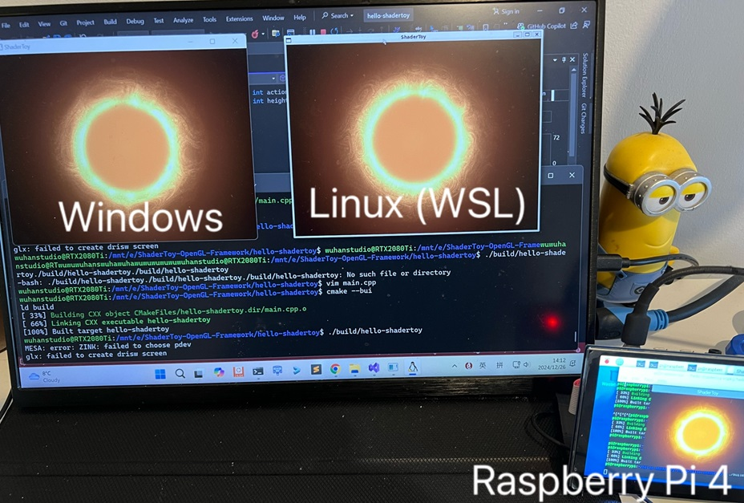

# Hello Shadertoy

> A shadertoy framework that runs on Windows and Linux, including ARM Linux.

- For Windows users, please open `hello-shadertoy.sln` using Visual Studio.
- For Linux users, please install `vcpkg` and `cmake` (>=3.25) first.



## Install vcpkg

```
$ sudo apt install build-essential pkg-config cmake curl zip unzip tar
$ sudo apt install libxinerama-dev libxcursor-dev xorg-dev libglu1-mesa-dev
$ sudo apt install libxrandr-dev libxi-dev

$ git clone https://github.com/microsoft/vcpkg.git
$ cd vcpkg
$ ./bootstrap-vcpkg.sh
$ echo 'export VCPKG_ROOT=$HOME/vcpkg' >> ~/.bashrc
$ echo 'export PATH=$PATH:$VCPKG_ROOT' >> ~/.bashrc
$ source ~/.bashrc

$ vcpkg integrate install
```

For raspberry pi:

```
$ export VCPKG_FORCE_SYSTEM_BINARIES=1
$ echo 'export VCPKG_FORCE_SYSTEM_BINARIES=1' >> ~/.bashrc
$ source ~/.bashrc
```


## Compile

```
$ git clone https://github.com/wuhanstudio/hello-shadertoy-vcpkg
$ cd hello-shadertoy-vcpkg

$ cmake -B build --preset vcpkg
$ cmake --build build
$ ./build/hello-shadertoy
$ ./build/hello-shadertoy shader/vert.glsl shader/fire_ball_frag.glsl
```

